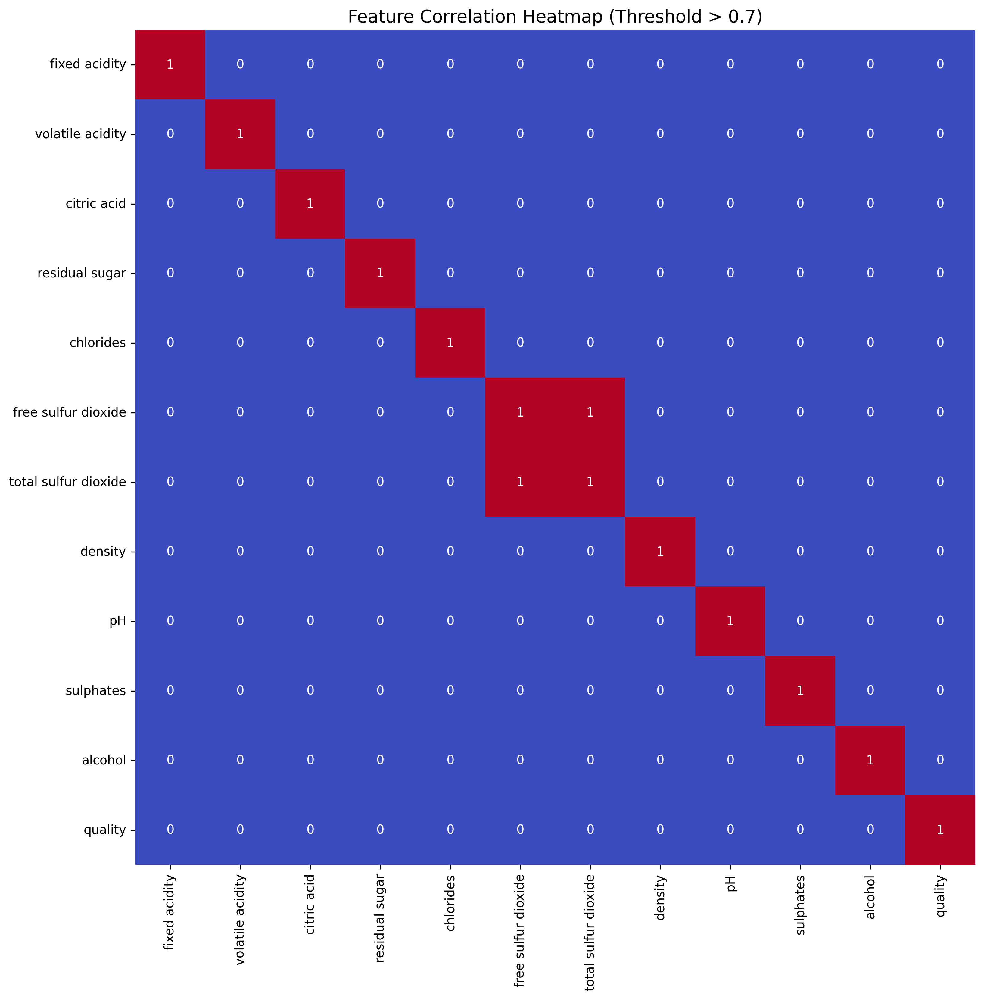
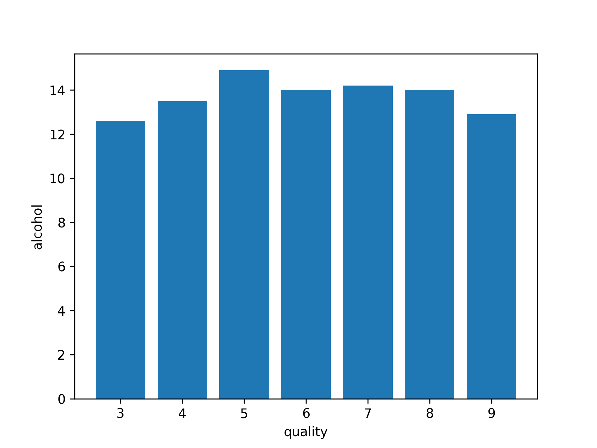
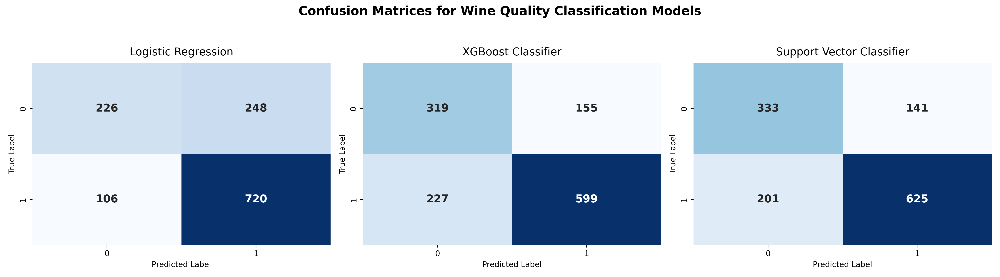

# 🍷 Wine Quality Prediction

> Predicting wine quality using machine learning based on physicochemical tests.

This project demonstrates a practical application of supervised machine learning for binary classification. Using real-world wine quality data, we predict whether a given wine sample is of good or bad quality, based on various chemical attributes.

---

## 🚀 Features

- Clean data preprocessing pipeline
- Exploratory Data Analysis (EDA) with insightful visualizations
- Machine Learning classification using XGBoost, logistic Regression, and SVC  
- Performance evaluation with metrics and plots
- Easily extensible and reproducible

---

## 📈 Exploratory Data Analysis (EDA)

Before building machine learning models, we performed exploratory data analysis to understand the structure and relationships in the dataset.

### 🔍 Key Steps:
* Missing Value Handling: Filled missing values with column-wise means.
* Distribution Analysis: Plotted histograms for all numerical features to examine distributions.
* Target Feature Relationship: Visualized alcohol content across different wine quality scores.
* Feature Correlation: Generated a heatmap to identify highly correlated features.

### 📊 Visualizations:

#### Heat Map
To better understand the relationships between features and identify multicollinearity, we plotted a **correlation heatmap** using a threshold of 0.7. This helped highlight strong relationships between variables.




####  Alcohol Content vs. Wine Quality

The bar chart below shows the average alcohol content across different wine quality scores. 




## 🎯 Results
### 🔍 Model Performance Overview

| Model                | Train Accuracy | Validation Accuracy | F1-Score |
|---------------------|----------------|----------------------|----------|
| Logistic Regression | 0.702          | 0.674                | 0.73     |
| XGBoost             | 0.976          | 0.699                | 0.98     |
| SVC                 | 0.707          | 0.730                | 0.74     |

> 📌 While XGBoost overfits slightly, SVC provides the best generalization performance.
---

### 📊 Models Confusion Matrices



## 🧠 Technologies Used

- Python 3.6+
- pandas, numpy
- seaborn, matplotlib
- scikit-learn
- XGBoost

---

## 🛠️ Installation

Clone the repository:
```bash
git clone https://github.com/AhmedZayed35/001_wine_quality.git
cd 001_wine_quality
```

Install dependencies:


```bash 
pip install -r requirements.txt
```
## 📂 Project Structure
```
001_wine_quality/ 
├── data/
│   └── winequality.csv
├── model.py
├── requirements.txt
└── README.md
```

## 📌 Future Work
- Hyperparameter tuning for improved model accuracy
- Feature importance analysis and dimensionality reduction
- Deployment as a web app using Flask or Streamlit
- Multi-class classification to predict exact quality scores

## 📧 Contact
- 📫 Email: ahmed.kh.zayed@gmail.com
- 🔗 LinkedIn: [linkedin.com/in/ahmed--zayed](https://www.linkedin.com/in/ahmed--zayed/)
